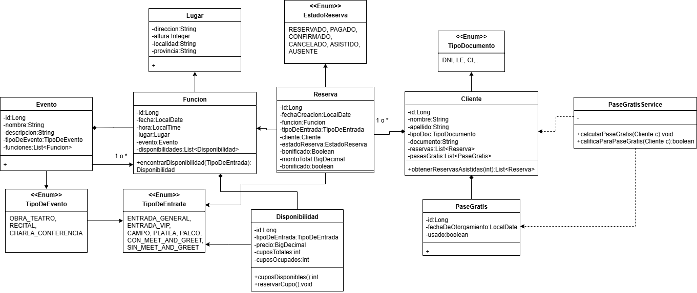

# Sistema de Gestión de Reservas
Proyecto para prueba técnica. 


# Configuración Inicial

Para comenzar con este proyecto, necesitarás tener lo siguiente instalado en tu máquina local:

- JDK 17 o superior
- Maven 3 o superior
- MySQL

## 1) Configuración de la Base de Datos

1. Asegúrate de que MySQL esté instalado y en funcionamiento en tu sistema.  
   Por defecto, se conectará a la base de datos en el puerto 3306 con el usuario `root` y una contraseña `root`.


2. Si tienes una configuración diferente de MySQL, actualiza el archivo [application.yml](src/main/resources/application.yml) en consecuencia.


3. Ejecuta el siguiente script para crear la base de datos: [script](/scripts/create-db.sql)

## 2) Para compilar y ejecutar el proyecto

1. Clona el repositorio:
   ```bash
   git clone https://github.com/23737k/sistema-de-gestion-de-reservas.git
   ```
  
2. Navega al directorio del proyecto:
   ```
   cd sistema-de-gestion-reservas
   ```
3. Instala las dependencias (asumiendo que Maven está instalado):
   ```
   mvn clean install
   ```
4. Ejecuta el proyecto:
   ```
   mvn spring-boot:run
   ```

5. Accede a la documentación de la API usando Swagger UI:

   Abre un navegador web y ve a http://localhost:8080/doc/swagger-ui.html

> La aplicación estará disponible en http://localhost:8080


Diagrama de Clases
-


Diagrama DER
-


