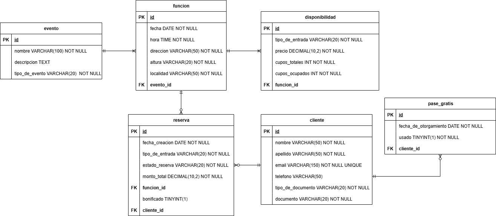

# Sistema de Gestión de Reservas
Proyecto para prueba técnica. 


# Configuración Inicial

Para comenzar con este proyecto, necesitarás tener lo siguiente instalado en tu máquina local:

- JDK 17 o superior
- Maven 3 o superior
- MySQL

## 1) Configuración de la Base de Datos

1. Asegúrate de que MySQL esté instalado y en funcionamiento en tu sistema.  
   Por defecto, se conectará a la base de datos en el puerto 3306 con el usuario `root` y una contraseña `root`.


2. Si tienes una configuración diferente de MySQL, actualiza el archivo [application.yml](src/main/resources/application.yml) en consecuencia.


3. Ejecuta el siguiente script para crear la base de datos: [script](/scripts/create-db.sql). 

## 2) Para compilar y ejecutar el proyecto

1. Clona el repositorio:
   ```bash
   git clone https://github.com/23737k/sistema-de-gestion-de-reservas.git
   ```
  

2. Ejecuta el siguiente script para crear la base de datos: [script](/scripts/create-db.sql). 
 Se recomienda usar phpmyadmin para importar el mismo


3. Navega al directorio del proyecto:
   ```
   cd sistema-de-gestion-de-reservas
   ```
4. Instala las dependencias (asumiendo que Maven está instalado):
   ```
   mvn clean install -DskipTests
   ```

5. Ejecuta el proyecto:
   ```
   mvn spring-boot:run
   ```

6. Accede a la documentación de la API usando Swagger UI:

   Abre un navegador web y ve a http://localhost:8080/swagger-ui.html

> La aplicación estará disponible en http://localhost:8080

---

## Detalles de la solución

### Problemas a resolver

- Los asistentes llaman o escriben para reservar y a veces olvidan pagar o confirman tarde.
- No hay una base de datos clara de clientes recurrentes.
- Entradas agotadas pero se siguen recibiendo reservas sin control.
- Queremos fomentar la fidelización, premiando a quienes asisten a varios eventos.

---

### Requisitos del sistema y su implementación

A continuación se enumeran los requisitos y cómo se resolvieron:

### 1. Tipos de eventos
**Requisito:**
- Obras de teatro (entrada general o VIP)
- Recitales (ubicaciones: campo, platea, palco)
- Charlas y conferencias (con o sin acceso a meet & greet)

**Implementación en la API:**
- Se modelaron los tipos de eventos con un **enum** y las entradas posibles asociadas a cada tipo.
- Por ejemplo: OBRA_DE_TEATRO, RECITAL, CHARLA_CONFERENCIA
- Cada tipo de evento tiene asociado un conjunto de tipos de entrada. 
- Por ejemplo, OBRA_DE_TEATRO tiene asociado ENTRADA_GENERAL y ENTRADA_VIP, RECITAL tiene asociado CAMPO, PALCO, PLATEA 
- El sistema valida cada vez que se crean nuevas funciones, disponibilidades o se reservan entradas que los tipos de entrada sean consistentes


### 2. Listado de eventos con disponibilidad actualizada

**Requisito:**

- Mostrar los eventos y la disponibilidad real por función.

**Implementación en la API:**

- Se diseñaron dos entidades: **Evento** y **Funcion**. 

- Un **Evento** contiene una lista de funciones, cada una con día, hora, lugar, y una lista de Disponibilidades.

- Una **Disponibilidad** representa la relación entre un tipo de entrada (por ejemplo PALCO) con su precio, cupos totales y cupos ocupados

- Se crearon una serie de endpoints, donde se pueden acceder de forma jerárquica dichos recursos y hacer todas las operaciones CRUD de cada recurso

Evento:

[GET /api/v1/eventos](http://localhost:8080/swagger-ui/index.html#/Eventos/obtenerEventos)

````Json
{
  "id": 3,
  "nombre": "Recital Banda XYZ",
  "descripcion": "Concierto en estadio local",
  "tipoDeEvento": "RECITAL"
}
````
[GET /api/v1/{:eventoId}/funciones](http://localhost:8080/swagger-ui/index.html#/Funciones/obtenerFunciones)

Función: 
`````Json
{
    "id": 4,
    "fecha": "2025-09-22",
    "hora": "21:00:00",
    "lugar": {
      "direccion": "Estadio Municipal",
      "altura": "100",
      "localidad": "Ciudad C",
      "provincia": "Provincia 3"
    },
    "disponibilidades": [
      {
        "id": 7,
        "tipoDeEntrada": "CAMPO",
        "precio": 1500,
        "cuposTotales": 500,
        "cuposOcupados": 0
      },
      {
        "id": 8,
        "tipoDeEntrada": "PLATEA",
        "precio": 2500,
        "cuposTotales": 200,
        "cuposOcupados": 0
      }
`````
### 3. Registro de reservas
**Requisito:**
- Registro de reservas con: fecha y hora del evento, nombre del asistente, tipo de entrada adquirida.

**Implementación en la API:**

- Se diseñaron endpoints para consultar y crear **Reservas** dentro del endpoint Clientes.
- Esto permite acceder a todas las reservas de un cliente o una reserva determinada.
- También se pueden crear reservas y cambiar el estado de las mismas. Siempre con estados consistentes que nuestro sistema validará: 


    - RESERVADO: estado por defecto de todas las reservas
    - PAGADO: reserva pagada
    - CONFIRMADO: reserva confirmada, previamente pagada
    - ASISTIDO: reserva confirmada y pagada, donde se marcó la asistencia del cliente
    - AUSENTE: reserva confirmada y pagada, donde se marcó la inasistencia del cliente
    - CANCELADO: reserva cancelada. Se puede cancelar en cualquier estado. Libera el cupo ocupado automáticamente.


- Cada **Reserva** contiene datos de las mismas como:


  - `fechaCreacion`: La fecha en que se generó la reserva en el sistema (por ejemplo, `"2025-08-16"`).
  - `funcionId`: Identificador de la función del evento asociada a la reserva. A través de este ID se puede obtener la fecha, hora y nombre del evento.
  - `tipoDeEntrada`: Tipo de entrada adquirida por el asistente, por ejemplo `"ENTRADA_VIP"`, `"GENERAL"`, `"CAMPO"`, etc.
  - `clienteId`: Identificador del cliente que realizó la reserva, para asociar la reserva a un usuario registrado.
  - `estadoReserva`: Estado actual de la reserva, como `"RESERVADO"`, `"CANCELADO"` o `"CONFIRMADO"`. Indica si la reserva está activa, pagada o cancelada.
  - `montoTotal`: Importe total de la reserva en la moneda correspondiente (por ejemplo, `2500` pesos).
  - `bonificado`: Indica si la reserva fue gratuita o bonificada por algún programa de fidelización. `true` si es bonificada, `false` si es pagada normalmente.

[GET /api/v1/clientes/{:clienteId}/reservas](http://localhost:8080/swagger-ui/index.html#/Reservas/obtenerReservas)

````Json
{
  "id": 1,
  "fechaCreacion": "2025-08-16",
  "funcionId": 1,
  "tipoDeEntrada": "ENTRADA_VIP",
  "clienteId": 1,
  "estadoReserva": "RESERVADO",
  "montoTotal": 2500,
  "bonificado": false
}

````

### 4. Fidelización de clientes
**Requisito:**
- Cada cliente que asista a 5 eventos en un año recibe un pase gratis para el siguiente.

**Implementación en la API:**
- Se agregó lógica de contabilización de asistencias por cliente.
- Si un cliente tiene 5 o más reservas en estado ASISTIDO en el mismo año, recibe un **Pase gratis**
- El mismo se aplica en la siguiente función de forma automática
- También pueden consultarse los pases gratis de un cliente y su estado


Pases gratis por Cliente:
````Json
{
  "id": 1,
  "nombre": "Juan",
  "apellido": "Pérez",
  "email": "juan.perez@email.com",
  "telefono": "+54 9 11 1234-5678",
  "tipoDeDocumento": "DNI",
  "documento": "12345678",
  "pasesGratis": [
    {
      "fechaDeOtorgamiento": "2025-08-16",
      "usado": false
    }
  ]
}
````

Reserva bonificada:
````Json
{
  "id": 6,
  "fechaCreacion": "2025-08-16",
  "funcionId": 1,
  "tipoDeEntrada": "ENTRADA_VIP",
  "clienteId": 1,
  "estadoReserva": "PAGADO",
  "montoTotal": 0,
  "bonificado": true
}
````


Diagrama de Clases
-


Diagrama DER
-



